# CSCI 5607 Project 2

## Commands
Where `jf.jpg` is the jelly fish image

|Category|Command|Image|
|---|---|---|
|**Noise**|`image -input jf.jpg -noise 0.1 -output img.jpg` | 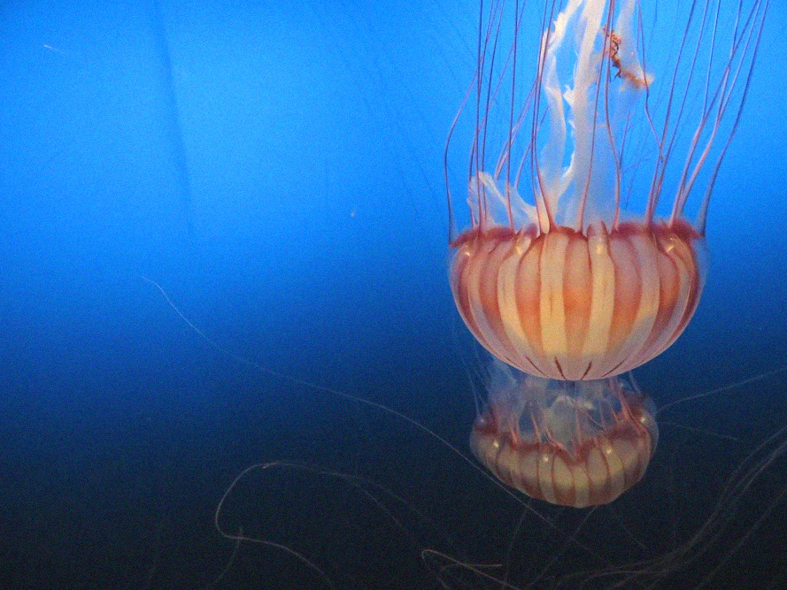 |
||`image -input jf.jpg -noise 0.5 -output img.jpg` | 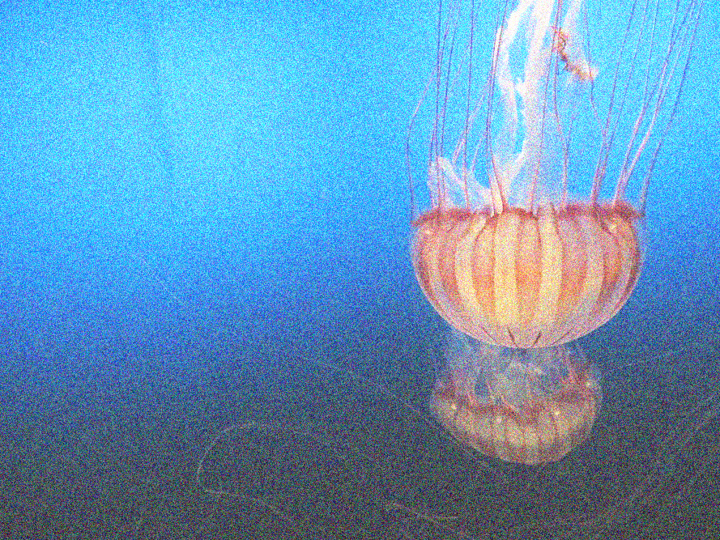 |
|**Brightness**|`image -input jf.jpg -brightness 0.5 -output img.jpg` | 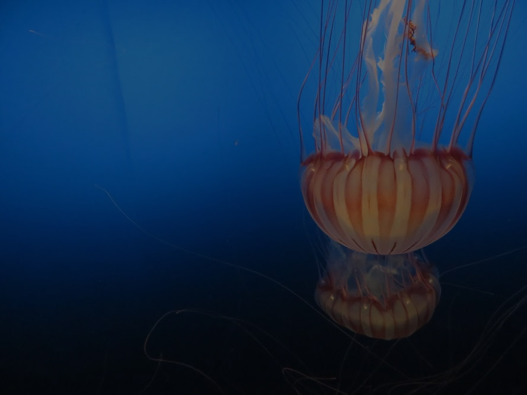 |
||`image -input jf.jpg -brightness 2 -output img.jpg` | 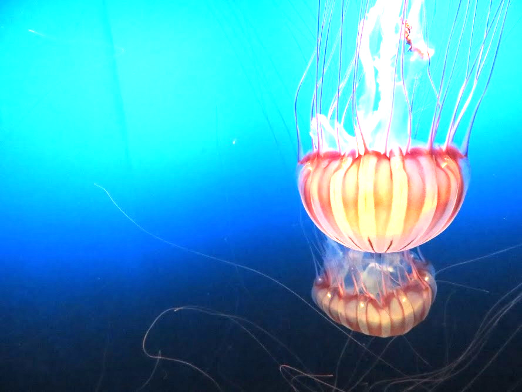 |
|**Contrast**|`image -input jf.jpg -contrast 0.5 -output img.jpg` |  |
||`image -input jf.jpg -contrast 1.5 -output img.jpg` | 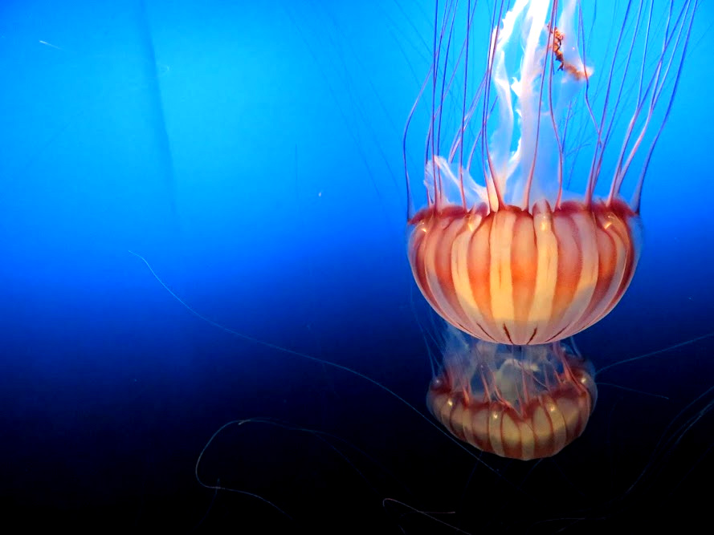 | 
|**Saturation**|`image -input jf.jpg -saturation 0.2 -output img.jpg` | 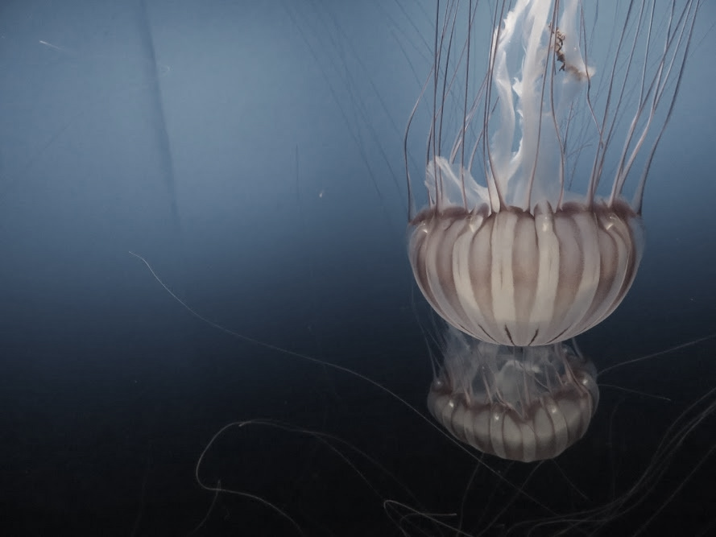 |
||`image -input jf.jpg -saturation 0.8 -output img.jpg` | 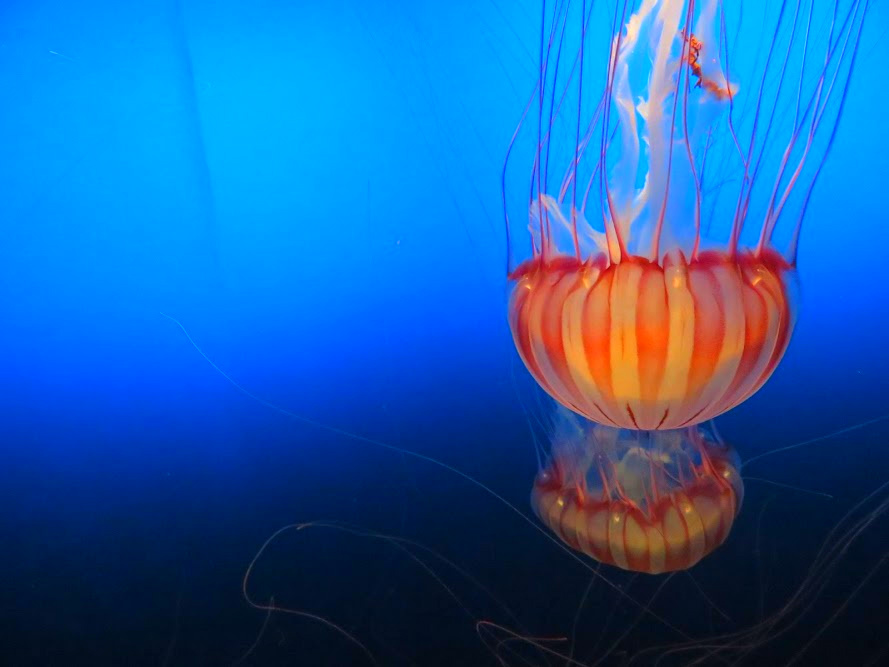 |
|**Crop**|`image -input jf.jpg -crop 600 300 100 200  -output img.jpg` | 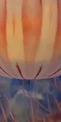 |
|**Extract Channel**|`image -input jf.jpg -extractChannel 0 -output img.jpg` | 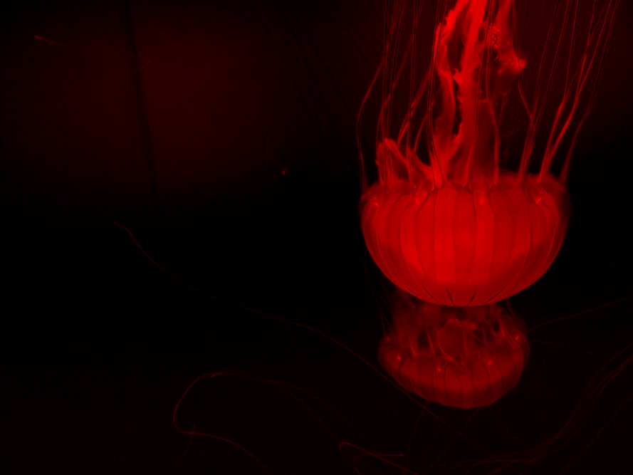 |
|**Quantize**|`image -input jf.jpg -quantize 2 -output img.jpg` | 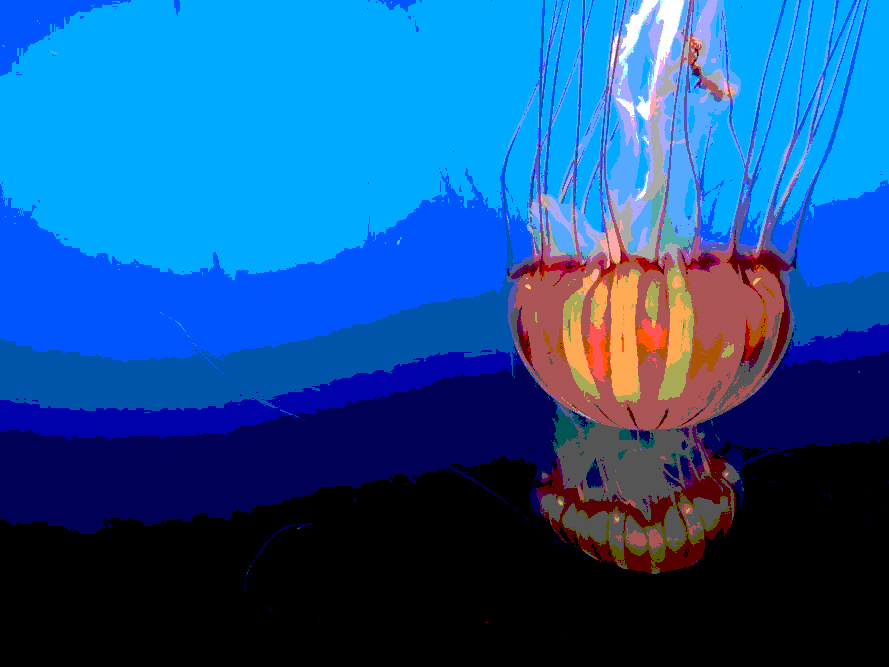 |
|**Random Dither**|`image -input jf.jpg -randomDither 2 -output img.jpg` | 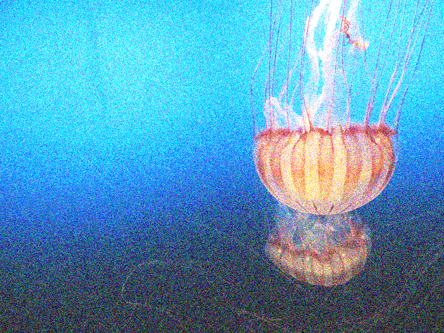 |
|**Blur**|`image -input jf.jpg -blur 2 -output img.jpg` |  |
|**Sharpen**|`image -input jf.jpg -sharpen 2 -output img.jpg` |  |
|**Edge Detect**|`image -input jf.jpg -edgeDetect -output img.jpg` | 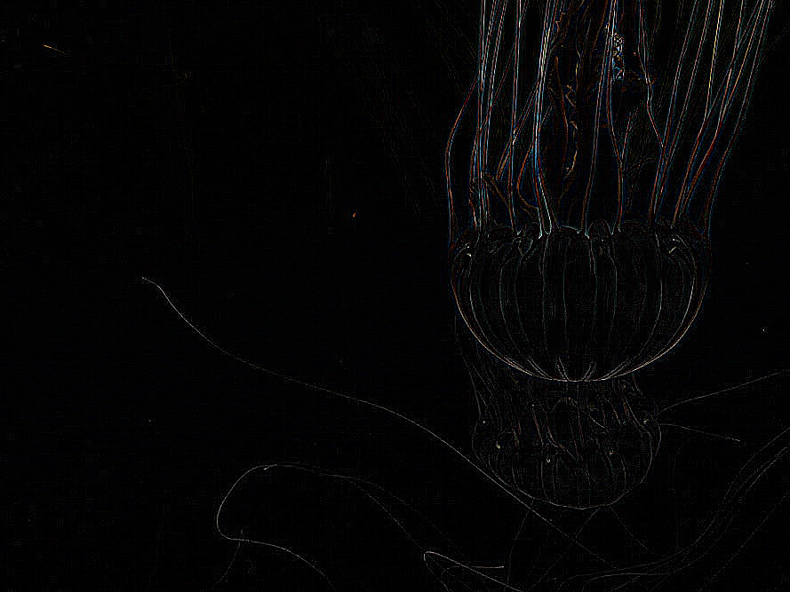 |
|**Floyd-Steinberg Dither**|`image -input jf.jpg -FloydSteinbergDither 2 -output img.jpg` | 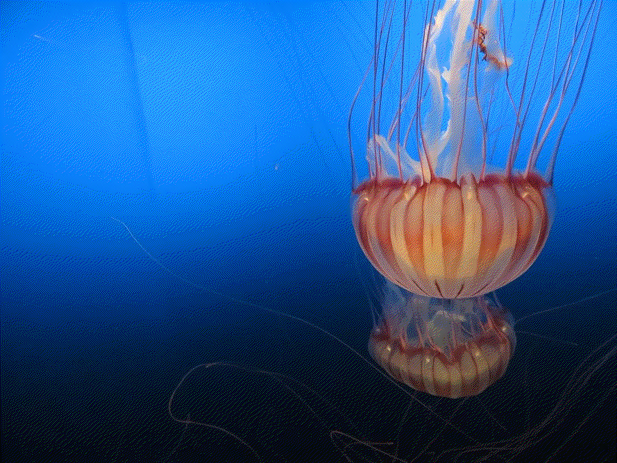 |
|**Scale**|`image -input jf.jpg -scale 1.5 2.3 -output img.jpg` | 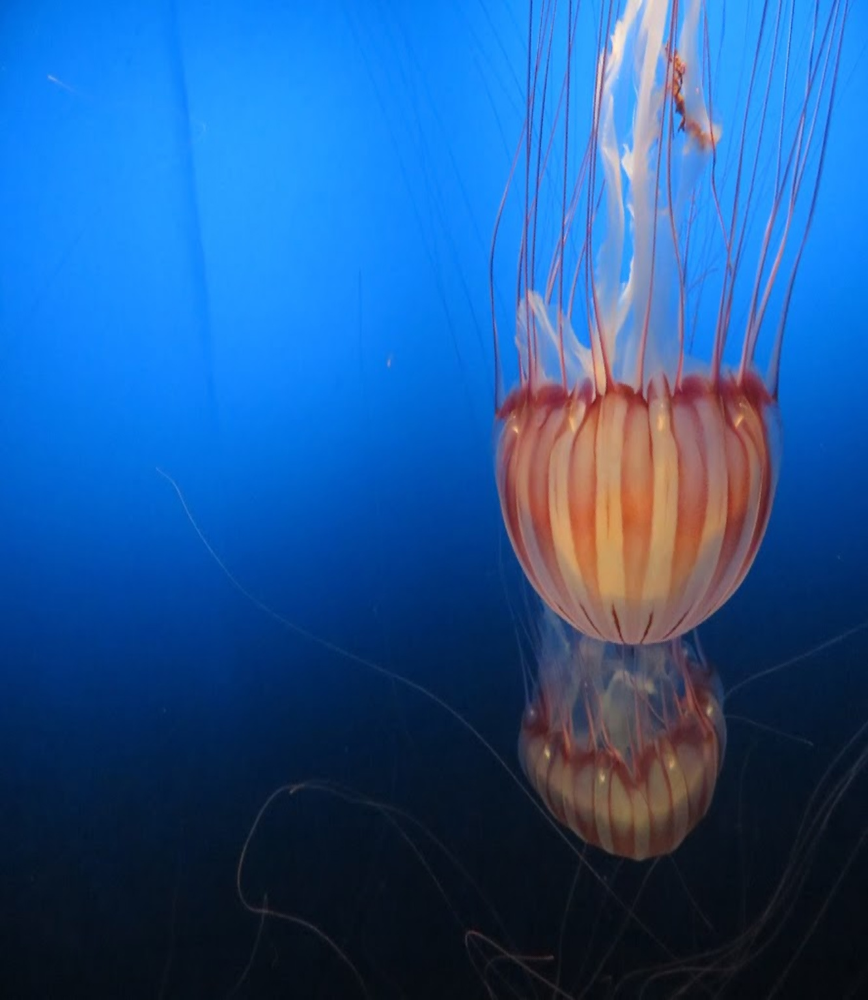 |
|**Rotate**|`image -input jf.jpg -rotate 45 -output img.jpg` | 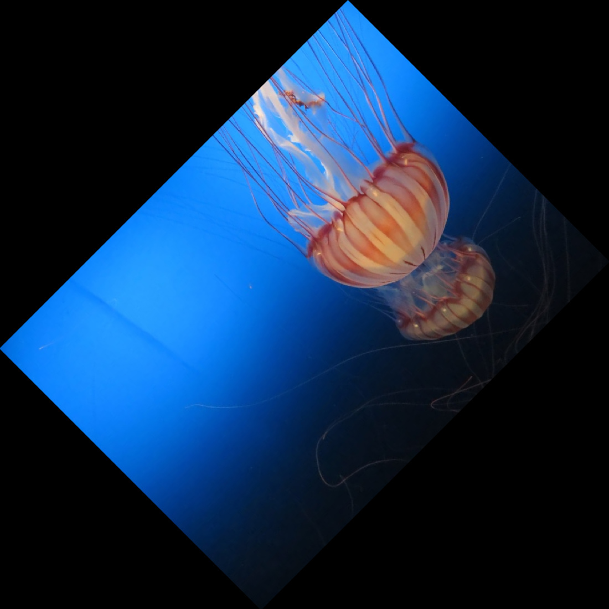 |